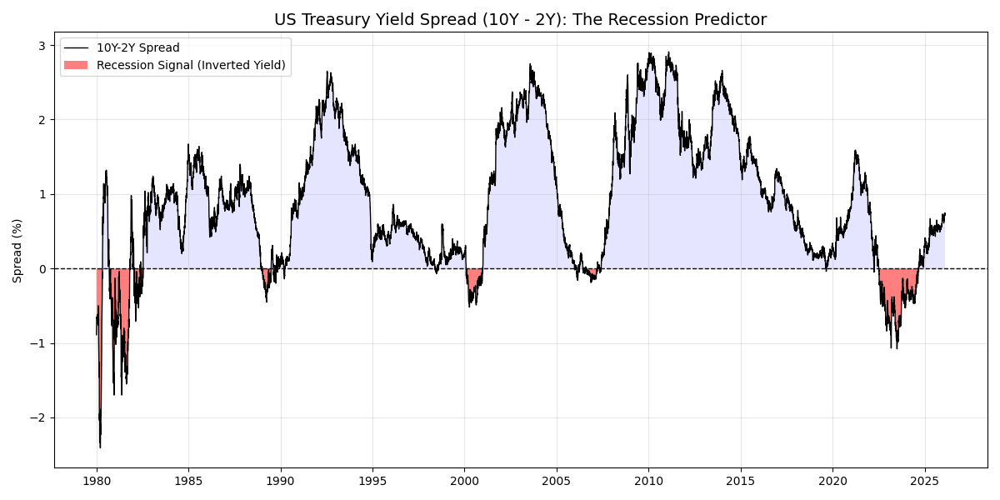

# US Treasury Yield Curve Analysis (10Y - 2Y)

## Overview
This project automates the extraction and visualization of the US Treasury Yield Curve spread (10-Year minus 2-Year), which is widely regarded as a leading indicator of economic recessions.
By fetching real-time data directly from the Federal Reserve Economic Data (FRED) API, this tool visualizes the "Inverted Yield Curve" phenomenon to identify potential market downturns.

## Key Findings: The Recession Signal
The visualization highlights periods where the spread turns negative (red zones).
* **Inverted Yield (Red Area)**: Historically, a sustained negative spread has preceded major economic recessions (e.g., the Dot-com bubble in 2000, the Global Financial Crisis in 2008).
* **Current Trend**: The analysis captures the recent deep inversion starting around 2022, signaling significant economic tightening.

## Visualization Result


## Tech Stack
* **Language**: Python 3.x
* **Data Source**: [FRED (Federal Reserve Economic Data)](https://fred.stlouisfed.org/)
* **Libraries**:
    * `pandas`: Direct data fetching via URL (bypassing legacy library issues) and time-series manipulation.
    * `matplotlib`: Custom visualization with conditional formatting (blue/red fill logic).

## Usage
To run this analysis and fetch the latest data:

```bash
# No API key required for this direct CSV method
python yield_curve_analytics.py